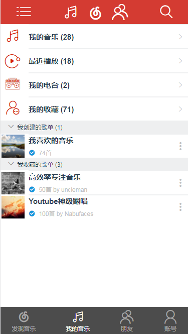

# vue-music

> 利用vue + vue-router + vuex + es6 + Webpack + less 搭建的模仿网易云音乐的vue项目

## Build Setup

``` bash
# install dependencies
npm install

# serve with hot reload at localhost:8080
npm run dev

# build for production with minification
npm run build

# build for production and view the bundle analyzer report
npm run build --report
```

初步效果图：


